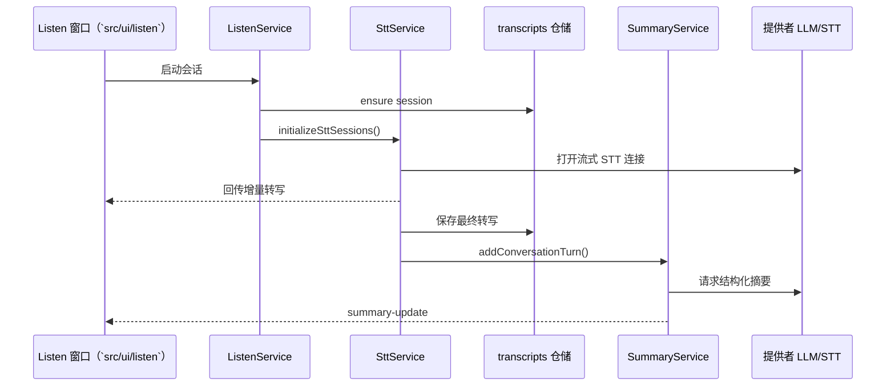

# Glass 架构

本文件概述 Glass 桌面产品在 Electron 内核、功能服务、本地数据层、内嵌 Web 栈以及云端服务之间的组装方式。它基于 `docs/DESIGN_PATTERNS.md` 中的原则，补充具体模块引用与运行时流程，帮助新加入的贡献者迅速建立全局认识。

---

## 1. 系统速览
- **产品形态**：一款 Electron 桌面应用，可记录屏幕上下文、实时转写会议内容、通过“Ask”界面查询历史活动，并在用户登录后与 Firebase 同步数据。
- **主要入口**：`src/index.js`（Electron 主进程）、`src/ui`（基于 Lit + 原生 JS 构建的渲染窗口）、`pickleglass_web/`（本地提供的 Next.js 控制台）、`functions/`（负责身份交换的 Firebase HTTPS 函数）。
- **运行环境**：Electron 主进程（Node.js API）、渲染窗口（Chromium + preload 沙箱）、用于控制台的内嵌 Express/Next.js 服务器、由服务管理的可选后台二进制（Ollama、Whisper、Rust AEC）。
- **状态管理**：各功能通过 `services` 编排业务逻辑，`repositories` 抽象持久化，`modelStateService` 统一管理 LLM/STT 配置与 API 凭证。
- **数据存储**：默认使用本地 SQLite，并通过仓储适配器切换至 Firestore。所有敏感字段在离开设备前都会被加密。

```mermaid
graph TD
    subgraph Electron Main (`src/index.js`)
        Index[启动流程与 IPC 接线]
        Windows[窗口管理器]
        FeatureBridge[featureBridge.js]
        Services[功能服务]
        DB[(SQLite)]
        LocalAI[本地 AI 运行时]
    end

    subgraph Renderer Windows (`src/ui`)
        Header[头部窗口]
        Listen[Listen 窗口]
        Ask[Ask 窗口]
        Settings[设置窗口]
    end

    subgraph Embedded Web (`pickleglass_web`)
        NextJS[Next.js 前端]
        NodeAPI[Express 后端]
    end

    subgraph Cloud
        Firebase[Firebase 认证与 Firestore]
        CloudFn[云函数：`functions/index.js`]
    end

    Index --> Windows
    Index --> FeatureBridge
    FeatureBridge --> Services
    Services --> DB
    Services --> LocalAI
    Windows <--> Renderer
    Renderer -->|"preload APIs"| FeatureBridge
    NodeAPI -->|"通过 eventBridge 的 IPC"| Services
    NextJS --> NodeAPI
    Firebase <--> CloudFn
    Services -->|仓储适配器| Firebase
```

---

## 2. Electron 内核（`src/`）

### 2.1 启动流程（`src/index.js`）
- 载入环境变量（`dotenv`）、设置单实例锁，并注册 `pickleglass://` 自定义协议用于深链。
- 按顺序初始化应用栈：
  1. 配置屏幕与音频捕获处理器（`desktopCapturer`、`session`）。
  2. 初始化 Firebase 客户端（`features/common/services/firebaseClient.js`）、SQLite（`databaseInitializer.js`）、身份服务（`authService.js`）与模型状态（`modelStateService.js`）。
  3. 装配桥接层（`featureBridge.js`、`windowBridge.js`），加载内嵌 Web 所需的仓储/服务。
  4. 启动本地 AI 预热（`ollamaModelRepository`、`ollamaService.autoWarmUpSelectedModel`）。
  5. 运行内嵌控制台服务器（`startWebStack()`），随后调用 `createWindows()` 打开各渲染窗口。
- 设置优雅退出：`before-quit` 会终止音频采集、结束活跃会话、关闭本地 AI 运行时，并安全关闭数据库。
- 打包环境下通过 `electron-updater` 注册自动更新。

### 2.2 窗口基础设施（`src/window/`）
- `windowManager.js` 构建并维护悬浮头部及各功能窗口（`listen`、`ask`、`settings`）。通过以下组件协调布局、动效与可见性：
  - `WindowLayoutManager` 与 `SmoothMovementManager` 负责动画与跨屏定位。
  - `internalBridge`（`src/bridge/internalBridge.js`）作为服务与窗口层之间的进程内事件总线。
- 全局快捷键（`shortcutsService.js`）及系统权限提示（`permissionService.js`）均通过同一桥接机制触发窗口事件。
- `windowBridge.js` 集中处理会变更窗口状态的 `ipcMain` 监听，确保 UI 仅调用公开的通道。


### 2.3 功能桥接层（`src/bridge/featureBridge.js`）
- 注册大部分暴露给渲染进程的 `ipcMain.handle` 接口。每个通道对应某个服务（设置、身份、Listen、Ask、本地 AI、权限、加密等）。
- 将 `modelStateService`、`localAIManager` 等服务的生命周期事件广播至所有窗口，保持 UI 状态同步。
- 封装本地 AI 安装进度等功能，避免渲染端直接操作服务。

### 2.4 Preload API（`src/preload.js`）
- 利用 `contextBridge.exposeInMainWorld` 将命名空间 API（`window.api.*`）暴露给 Lit 组件（`src/ui/**`）。
- 这些调用通过 `ipcRenderer.invoke/send` 转发，对应 `featureBridge.js` 与 `windowBridge.js` 中注册的处理器，从而在沙箱中保证可控的通信面。

---

## 3. 功能域（`src/features/`）

### 3.1 Ask（`src/features/ask/`）
- `askService.js` 管理“Ask Glass”窗口：
  - 利用 macOS `screencapture` 或 Electron `desktopCapturer` 捕获截图，若可用则通过 `sharp` 进行压缩。
  - 收集用户提问或“仅屏幕”请求，使用提供者工厂的 `createStreamingLLM` 拉起流式对话，并处理终止/超时。
  - 通过 `ask/repositories` 与 `sessionRepository` 持久化问答内容与会话元数据。
  - 通过 `internalBridge` 控制窗口可见性，并使用 `featureBridge.sendAskProgress` 向 UI 广播进度。

### 3.2 Listen（`src/features/listen/`）
- `listenService.js` 负责实时转写：
  - 管理会话生命周期（`sessionRepository.getOrCreateActive`、`closeSession`），并切换 `listen` 窗口状态。
  - 将语音转写委派给 `sttService.js`，该服务会把麦克风/系统音频推送给所选模型，去抖句子，并把结果回传 UI。
  - 将对话轮次交给 `summaryService.js`，后者调用当前 LLM 模型（`modelStateService.getCurrentModelInfo('llm')`）生成结构化摘要，并存入 `listen/summary/repositories`。
  - 通过事件向渲染层推送状态，并在 STT 初始化失败时进行重试管理。

### 3.3 设置与模型管理（`src/features/settings/` + `src/features/common/services/`）
- `settingsService.js` 向 UI 提供预设 CRUD、自动更新开关与模型状态。
- `modelStateService.js` 是 LLM/STT 配置的单一真相源：负责迁移遗留数据、通过 `encryptionService.js` 加密 API Key、追踪当前模型并响应本地 AI 状态变化。
- `localAIManager.js` 维护 Ollama（LLM）与 Whisper（STT）运行时的下载、启动、诊断，并向头部与设置窗口发布进度事件。
- `providerSettingsRepository` 保存提供者元数据，AI 提供方工厂（`common/ai/factory.js`）统一封装各家实现。

### 3.4 快捷键与权限
- `shortcutsService.js` 负责快捷键注册、持久化与快捷键编辑窗口。
- `permissionService.js` 检查/申请操作系统权限（麦克风、辅助功能、钥匙串），并把完成状态写入 `permissions` 表。
- 两者的 IPC 通道均集中在 `featureBridge` 下，使渲染逻辑保持声明式。

---

## 4. 数据与持久化

### 4.1 本地存储（基于 Better-SQLite3）
- `features/common/services/databaseInitializer.js` 在 `app.getPath('userData')` 下复制或创建 `pickleglass.db`，通过 `sqliteClient.synchronizeSchema()` 校验结构、初始化默认数据，并清理孤立会话。
- 模式定义位于 `features/common/config/schema.js`，涵盖用户、会话、转写、AI 消息、摘要、预设、提供者设置、快捷键、权限以及本地模型注册表。
- `sqliteClient.js` 封装底层 DB 访问，包含迁移（如 `provider_settings` 结构调整）、建表、工具方法（`cleanupEmptySessions`、`initDefaultData`）等。

### 4.2 仓储适配器
- 每个仓储目录（如 `features/common/repositories/session/`）导出一个适配器，根据 `authService.getCurrentUserMode()` 在 SQLite 与 Firestore 实现之间切换。
- 适配器会在调用前注入当前用户 ID，确保服务层无需关心持久化细节。

### 4.3 远端同步与加密
- 用户登录后，仓储会调用 Firestore 实现；对应的转换器通过 `encryptionService` 对 payload 自动加解密。
- `migrationService.js` 在用户登录时负责离线数据与线上数据的迁移；`authService.js` 在登出时关闭会话并重置密钥。

---

## 5. AI 与媒体管线

### 5.1 提供者工厂（`features/common/ai/factory.js`）
- 中央注册表 `PROVIDERS` 枚举所有支持的 LLM/STT 后端：OpenAI（标准与 Glass 托管）、Gemini、Anthropic、Deepgram、火山引擎豆包流式 ASR、本地 Ollama、本地 Whisper。
  - 导出 `createLLM`、`createStreamingLLM`、`createSTT`、`getProviderClass` 等 helper，以统一的参数结构实例化各提供者。当前注册的 LLM/STT 提供者包括 OpenAI、Kimi、Gemini、Anthropic、Deepgram、Doubao 以及本地的 Ollama / Whisper，其中 Glass 托管的 OpenAI（`-glass`）会在 Firebase 登录后使用虚拟密钥；豆包凭证默认从 `.env` (`DOUBAO_APP_KEY/DOUBAO_ACCESS_KEY`) 读取。

### 5.2 模型选择与状态
- `modelStateService` 在 API Key 变动时自动选择有效模型，监听 `localAIManager` 事件以在本地运行时停止时修复状态，并向渲染窗口广播 `state-updated`。
- 相关信息存储于 `provider_settings` 表；electron-store 仅用于遗留迁移。

### 5.3 实时转写流程



### 5.4 Ask 与摘要流程
- Ask 流程会捕获截图（若权限允许）、组合聊天历史（`sessionRepository`），并通过所选 LLM 流式生成回复；结果写入 `ai_messages`。
- 摘要流程聚合近期对话轮次，引入上一轮分析上下文，使用 `getSystemPrompt('pickle_glass_analysis')` 调用 LLM 生成要点与后续建议。

### 5.5 本地 AI 运行时
- `localAIManager` 封装 Ollama/Whisper 的下载与生命周期管理，进度与错误通过 `localai:*` 通道暴露给渲染窗口（`preload.js` 提供接口）。
- 对于 Ollama，`ollamaModelRepository.initializeDefaultModels()` 预置已知模型元数据；`ollamaService` 提供安装、校验、预热等能力，由设置界面和启动流程调用。

---

## 6. 内嵌 Web 栈（`pickleglass_web/`）

### 6.1 前端（`pickleglass_web/app/`）
- 基于 Next.js 14（React 18），结合 Tailwind 与共享组件库（`components/`）。通过 `next build` 生成静态产物存放在 `pickleglass_web/out`，供主进程本地提供。
- 主要用于身份登录、查看会话、预设与个人信息，与桌面端在线时保持一致体验。

### 6.2 后端桥接（`pickleglass_web/backend_node/`）
- `backend_node/index.js` 创建 Express 服务，配置 CORS、JSON 解析，并为每个请求注入 IPC 桥。
- `middleware/auth/identifyUser` 通过 IPC 解析桌面端用户，再提供 `/api` 路由。
- 各路由（`routes/auth`、`routes/user`、`routes/conversations`、`routes/presets`）调用 `ipcBridge.ipcRequest`，向共享的 `eventBridge` 发出 `web-data-request`，等待主进程在响应通道返回数据。

### 6.3 运行时编排（`src/index.js` 中的 `startWebStack`）
- 动态分配两个空闲端口（API 与前端），设置 `pickleglass_API_URL/WEB_URL` 环境变量，并在系统临时目录写入运行时配置供静态前端读取。
- 通过 Express 提供预构建的 Next.js 产物；若缺少构建文件，会给出提示并退出（需在 `pickleglass_web` 中执行 `npm run build`）。
- Electron 退出时确保两个服务器都能优雅关闭。

---

## 7. 云端集成

- **Firebase Auth**：`features/common/services/firebaseClient.js` 初始化 SDK；`authService.js` 监听 `onAuthStateChanged`，处理虚拟密钥获取（通过云函数交换 ID Token），并驱动迁移与加密配置。
- **云函数**（`functions/index.js`）：HTTPS 函数 `pickleGlassAuthCallback` 校验 ID Token、签发自定义 Token 并返回用户信息，供桌面端深链登录流程调用。
- **Firestore**：仓储适配器在登录状态下切换为 Firestore 实现，转换器会自动调用 `encryptionService` 进行加解密。
- **深链**：`setupProtocolHandling()` 注册 `pickleglass://` 协议处理登录与个性化流程，兼容 macOS（`open-url`）与 Windows/Linux（`second-instance`），启动完成后会处理等待中的链接。

---

## 8. 构建与交付

- **渲染端打包**：`build.js` 使用 esbuild 构建 `src/ui/app/HeaderController.js` 与 `src/ui/app/PickleGlassApp.js`，生成至 `public/build/`。执行 `npm run build:renderer`（或 `npm run build:all`）触发该步骤。
- **Web 控制台构建**：`pickleglass_web/package.json` 定义 Next.js 构建脚本，`npm run build:web` 产出供内嵌服务器使用的静态资源。
- **应用打包**：`electron-builder.yml` 定义安装包目标，根目录脚本（`start`、`build`、`package`、`make`、`publish`）会串联渲染端与 Web 构建并调用 electron-builder。自动更新由 `electron-updater` 负责。
- **测试与 lint**：`npm run lint` 使用 ESLint 检查 TS/JS（含 Next.js 工作区）。当前缺少自动化测试，需要手工验证音频采集、AI 流程与认证。

---

## 9. 配置与密钥

- 开发阶段通过 `.env` 加载环境变量，关键项包括 `OPENAI_API_KEY`、`GEMINI_API_KEY`、`ANTHROPIC_API_KEY`、`DEEPGRAM_API_KEY`、`OPENAI_TRANSCRIBE_LANG` 等。
- Firebase 凭证通过 `firebase.json` 与 `firestore.indexes.json` 嵌入到打包应用。
- 各提供者的 API Key 保存在 `provider_settings`（SQLite）或加密后的 Firestore 文档。macOS 使用 Keychain（通过 `keytar`）安全持久化其他平台则退化为会话内存。
- 本地 AI 下载（Ollama、Whisper）遵循 `localAIManager` 判定的各平台默认目录。

---

## 10. 关键目录与文件

- `src/index.js`：主进程启动、深链、内嵌 Web 服务器。
- `src/window/`：窗口创建、布局管理、平滑移动控制器。
- `src/bridge/`：IPC 桥接（`featureBridge`、`windowBridge`、`internalBridge`）。
- `src/features/`：功能服务、仓储、提示词与工具。
- `src/ui/`：基于 Lit 的渲染窗口与样式。
- `pickleglass_web/`：Next.js 前端（`app/`）与 Express 后端（`backend_node/`）。
- `functions/`：Firebase 云函数入口（`index.js`）。
- `docs/DESIGN_PATTERNS.md`：与本指南配套的设计原则与仓储/服务约定。

---

## 11. 扩展点与后续工作

- **新增提供者**：在 `features/common/ai/providers/<provider>.js` 中实现，注册进 `factory.js`，如需额外元数据请同步扩展 `provider_settings` 迁移。
- **新增功能**：在 `src/features/<feature>` 下创建服务/仓储，并通过 `featureBridge` 暴露 IPC，UI 放在 `src/ui/<feature>` 中。
- **扩展 Web 控制台路由**：在 `pickleglass_web/backend_node/routes` 添加 Express 路由，在 `src/index.js` 的 `setupWebDataHandlers()` 定义对应 IPC 行为，并在 Next.js 侧消费。
- **文档**：在团队内推广本架构指南，并配合 `docs/DESIGN_PATTERNS.md` 用于新成员培训或大型重构规划。

---

通过将业务逻辑集中在服务层、统一使用仓储适配器、并在桥接层集中 IPC 管理，Glass 在 UI、功能编排与持久化之间保持了清晰的边界。探索新功能或跨桌面/Web/云端排查问题时，可将本文件作为导航图。

## 12. 浮窗 invisible 原理
- Glass 通过 Electron 提供的 BrowserWindow.setContentProtection(true) 把所有浮窗标记为“受保护内容”，屏幕录制/共享框架在尝试捕获这些窗口时只能拿到空帧或纯色，从而实现“共享屏幕时对方看不到 Glass”的效果。
- 该 API 在 macOS 上会把 NSWindowSharingNone 等安全标志应用到原生窗口，在 Windows 上则使用 SetWindowDisplayAffinity 等底层机制屏蔽采集。
- 代码入口集中在 src/window/windowManager.js:31（默认开启 isContentProtectionOn）、src/window/windowManager.js:408（setContentProtection 会遍历 windowPool 为所有窗口调用 win.setContentProtection(...)）、以及各窗口创建处：src/window/windowManager.js:464（Listen 窗口）、src/window/windowManager.js:495（Ask 窗口）、src/window/windowManager.js:528（Settings 窗口）、src/window/windowManager.js:570（快捷键编辑器）和 src/window/windowManager.js:722（主 Header）。这些调用确保无论是头条窗口还是子窗口，只要出现都会带着内容保护标志。
- 同一文件里的 toggleContentProtection（src/window/windowManager.js:420）提供了运行时切换能力，便于后续在设置面板或快捷键中开放“允许屏幕共享时可见/不可见”的开关。

## 13. 增加自定义 LLM 模型支持
- Kimi K2 模型支持
